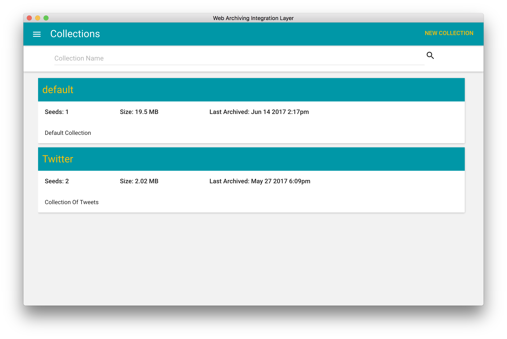

<h2 align="center">
  &nbsp;Web Archiving Integration Layer (WAIL)</h2>

<em>"One-Click User Instigated Preservation"</em>

Web Archiving Integration Layer (WAIL)

_"One-Click User Instigated Preservation"_

Web Archiving Integration Layer (WAIL) is a graphical user interface (GUI) atop multiple web archiving tools 
intended to be used as an easy way for anyone to preserve and replay web pages. 
Tools included and accessible through the GUI are [Heritrix 3.2.0](https://github.com/internetarchive/heritrix3) 
and [PyWb 0.33.0](https://github.com/ikreymer/pywb).

More information about the motivations behind WAIL see the [Motivations](https://github.com/N0taN3rd/wail/wiki/Why-Wail%3F) section in the projects wiki.

This work is supported by the [National Endowment for the Humanities](https://www.neh.gov/) (NEH), through Digital Humanities grants [HD-51670-13](https://securegrants.neh.gov/publicquery/main.aspx?f=1&gn=HD-51670-13) and [HK-50181-14](https://securegrants.neh.gov/publicquery/main.aspx?f=1&gn=HK-50181-14)

## WAIL Electron

## Usage
You can download the latest release [here](https://github.com/N0taN3rd/wail/releases). 

For information on using WAIL please consult the [wiki](https://github.com/N0taN3rd/wail/wiki)

To get up and running from source consult the Development section in this projects wiki.

### Slides from Archives Unleased 2.0
[Are Wails Electric?](http://www.slideshare.net/JohnBerlin3/are-wails-electric)

## Problems? Questions?

Please see the [Frequently Asked Questions](https://github.com/N0taN3rd/wail/wiki/FAQ) page.

## Contact

WAIL is a project of the Web Science and Digital Libraries (WS-DL) research group at Old Dominion University (ODU), created by Mat Kelly.

For support e-mail jberlin@cs.odu.edu or tweet to us at [@johnaberlin](https://twitter.com/johnaberlin) and/or [@WebSciDL](https://twitter.com/WebSciDL).
